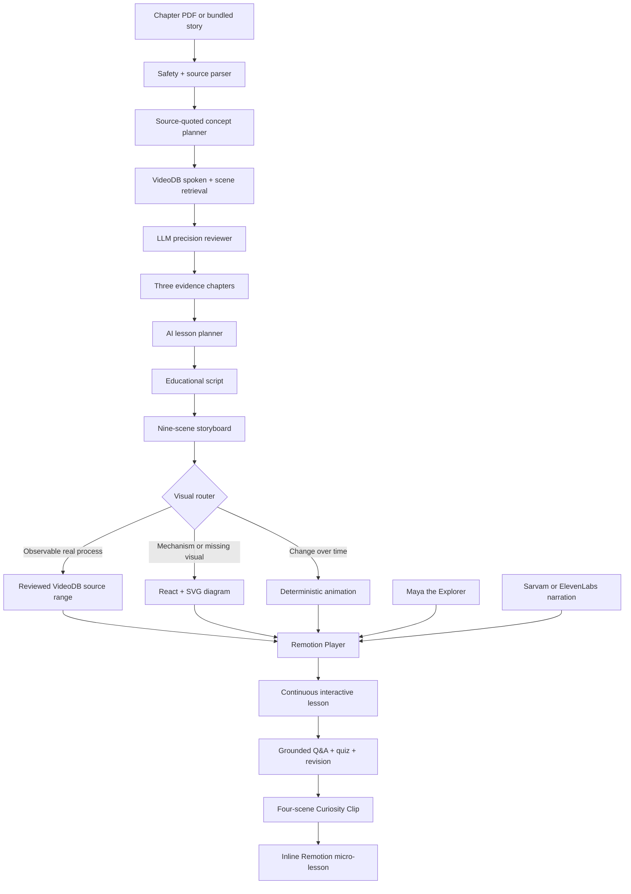

# Hybrid lesson presentation architecture

Last reviewed: 2026-07-27

## Product decision

KathaQuest is an AI lesson studio, not a generic text-to-video wrapper. The
chapter is converted into a validated teaching plan and executable storyboard.
The browser then renders one continuous lesson that mixes reviewed footage with
deterministic diagrams, animation, captions, keywords, Maya the Explorer,
narration and a checkpoint.

Generating every frame with a diffusion video model was intentionally excluded
from the production request path. It would make lessons slower, costlier and
less reproducible. Missing explanatory visuals are generated as reusable
React/SVG teaching components and animated in Remotion. `pan_zoom` provides the
image-to-motion pattern without inventing scientific events.

## Executable contract

Every successful lesson contains:

- `EducationalLessonPlan`: title, big question, audience, grounded objectives
  and teaching arc;
- `EducationalVideoScript`: hook, complete narration, verified word count and
  closing;
- `LessonStoryboard`: 1280×720 at 30 fps, total duration and exactly nine
  typed scenes; and
- `StoryboardScene`: timing, narration, subtitle, keywords, transition,
  diagram template, animation style, footage reference and evidence references.

`lesson-presentation-v1.2.0` is the versioned structured-output prompt. Zod
validates its result. If the AI output violates the contract, a deterministic
chapter-grounded storyboard keeps the user journey usable.

## Runtime pipeline

The Remotion Player is used inside Next.js with runtime input props. Each
storyboard scene becomes a `Sequence`; the same JSON can later be sent to a
Remotion Lambda or a worker-based renderer for downloadable MP4 output.

Relevant primary documentation:

- [Remotion Player](https://www.remotion.dev/docs/player)
- [Remotion Sequence](https://www.remotion.dev/docs/sequence)
- [Remotion parameterized rendering](https://www.remotion.dev/docs/parameterized-rendering)
- [VideoDB Timeline architecture](https://docs.videodb.io/pages/act/programmable-editing/timeline-architecture)

## Implemented layers 1–8

| Layer | Production MVP implementation |
| --- | --- |
| 1. Lesson planner | Versioned OpenAI structured output grounded in verified chapter quotes and reviewed evidence |
| 2. Storyboard | Nine typed scenes with timing, narration, captions, keywords, motion, transitions and evidence references |
| 3. Visual assets | Reusable SVG concept maps, cycles, processes, layers, comparisons, orbits and cause/effect diagrams |
| 4. Animation | Remotion sequences and frame-driven React/SVG motion |
| 5. Smart retrieval | VideoDB spoken + scene search, LLM reranking, timestamp expansion, deduplication and stitching |
| 6. Missing animation | Deterministic diagram templates replace unsupported or unavailable footage |
| 7. Image-to-motion | `pan_zoom`, reveal, flow, pulse and orbit treatments; no expensive full-video generation |
| 8. Character teacher | Maya the Explorer appears consistently in opening and recap scenes |

## Curiosity Clips

The “Still curious?” path uses the same presentation contract instead of
returning a disconnected chat response. The text answer is returned first;
narration is prepared in a second request so voice latency never hides the
answer.

Each clip contains exactly four scenes:

1. Maya reframes the child’s question as a curiosity hook.
2. A labelled diagram builds the core mental model.
3. Strictly reviewed VideoDB footage shows direct evidence, or a deterministic
   animation explains the mechanism when no relevant footage exists.
4. A checkpoint recalls the answer and asks the child to predict or explain.

The encrypted clip token prevents the narration endpoint from speaking
client-supplied text. Clips and their two scene-synchronized narration acts are
cached by lesson, language, question and provider, so repeat questions and page
navigation do not repeat paid generation.

Manim and generative image/video models remain optional specialist renderers,
not dependencies of the serverless interaction path. A future visual router can
send geometry-heavy STEM scenes to Manim and approved illustration briefs to an
image model while preserving the same storyboard contract.

## Accuracy and safety gates

- Exactly three objectives must quote the source chapter verbatim.
- VideoDB candidates are accepted only from the reviewed all-ages allowlist.
- An LLM precision reviewer must assign at least `0.55` confidence and explain
  why the moment teaches the objective.
- Each evidence chapter must contain at least 50 seconds of useful footage.
- The presentation must contain nine scenes, run at least 150 seconds, include
  guide/diagram/animation/real-video/checkpoint/recap scenes, and contain a
  complete 180–450-word narration.
- Every real-video scene must retain direct media and timestamp evidence.
- Unsupported concepts fail or switch to a grounded diagram; KathaQuest does
  not show a superficially related clip.

## Multilingual audio

Content language and film-audio language are independent controls. The complete
script can be narrated in any of eleven supported Indian languages. Auto mode
uses Sarvam first for Indian-language voices and falls back to ElevenLabs;
either provider can also be explicitly requested. Selecting a new language or
provider invalidates the previous audio so mismatched narration cannot continue
playing.

## Rendering boundary

The shipped product is a continuous interactive Remotion film in the browser.
It does not yet render and persist a downloadable MP4. Rendering Chromium and
FFmpeg inside an ordinary Vercel function is not a safe production design.
Downloadable exports should be queued to Remotion Lambda or a dedicated worker,
then stored behind a signed URL.
