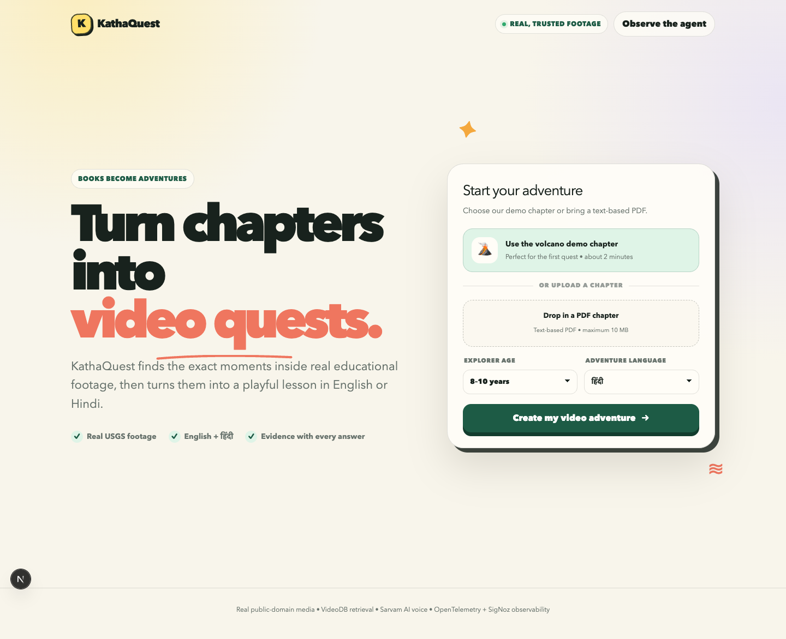
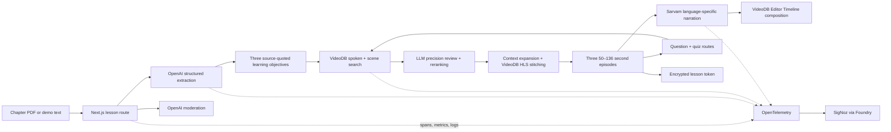

# KathaQuest

> Turn textbook chapters into multilingual video adventures using real educational footage.

KathaQuest reads a science chapter, extracts three age-appropriate concepts, searches a trusted archive for exact moments that explain them, and compiles complementary moments into substantial video lessons. Children can switch the complete lesson and its synchronized narration among 11 Indian languages, ask a typed or spoken question, and get an answer backed by another real video clip when the archive has direct evidence.

The reviewed archive contains 12 all-ages videos from USGS, NASA, NOAA and the U.S. National Park Service. VideoDB—not a mock—provides ingestion, spoken-word indexing, scene understanding, semantic retrieval, timestamp evidence, HLS compilation and narration/video composition.



## Why it exists

Textbooks can feel static, while the best explanation may be buried inside a long lecture or scientific recording. Generic AI video generation introduces another problem: the picture can look convincing without being real.

KathaQuest uses the chapter as a learning roadmap and retrieves evidence from trusted footage. Every clip exposes its source, licence, timestamps and relevance score.

## Demo flow

1. Select one of five original chapter stories or upload a text-based PDF.
2. Choose an age group and one of 11 Indian languages.
3. Generate exactly three concepts and three precision-reviewed VideoDB episodes of at least 50 seconds each.
4. Change the learning language at any point and create a warm, synchronized narrated version of any reel.
5. Ask a typed question or record a question in the learning language.
6. Complete the quiz; missed concepts create a VideoDB revision reel.
7. Arm the developer failure control and confirm that narration failure is explained without breaking the lesson.
8. Inspect the matching trace, metrics and structured logs in SigNoz.

## Architecture



The app is one strict-TypeScript Next.js repository. External credentials remain in server-only environment variables. Quiz answers stay inside a 24-hour AES-256-GCM lesson token and are never returned as readable browser data.

## VideoDB depth

- Twelve real, reviewed sources from USGS, NASA, NOAA and NPS in one collection
- Spoken-word indexes for narrated educational evidence
- Detailed visual scene indexes describing educational actions, objects, diagrams and processes
- Collection-wide semantic search across both index types and up to three objective-specific queries
- Kid-safe allowlist filtering before any clip can be compiled
- Cross-query pooling, topic boosting and deduplication of overlapping timestamp results
- A structured LLM precision gate that rejects indirect evidence and records its reason and confidence
- Context expansion around useful moments and stitching of up to four complementary clips
- A 50-second minimum for generated lesson episodes
- One automatic LLM query rewrite when a search is empty
- Exact source title, start/end time, match type and confidence in the UI
- Search-result compilation into browser-playable HLS
- Sarvam narration uploaded as a VideoDB audio asset and synchronized with the original clip timeline
- New searches for child questions and quiz revision

Source and licence records live in [`data/demo-videos.json`](data/demo-videos.json). Runtime VideoDB IDs are cached locally by the seeding script and intentionally ignored by Git. The evaluated VideoDB capabilities, implementation decisions and provider limitations are recorded in [`VIDEODB_RESEARCH.md`](VIDEODB_RESEARCH.md).

## Language and voice support

English, Hindi, Bengali, Tamil, Telugu, Marathi, Gujarati, Kannada, Malayalam, Punjabi and Odia are supported. Changing the learning language localizes the title, objectives, explanations and quiz into the language’s native script while preserving the original verified chapter quote internally.

Sarvam Bulbul v3 is the primary narrator for all languages. Each language uses a recommended speaker with a slightly slower storytelling pace and warm delivery suitable for children. This is a friendly educational voice—not an imitation of a child. VideoDB’s Editor Timeline combines the new narration with the retrieved video; the player falls back to browser synchronization if remote composition is temporarily unavailable.

## SigNoz observability

The root `lesson.generate` trace includes:

- `document.extract`
- `llm.extract_concepts`
- `videodb.search_concept`
- `videodb.rewrite_query`
- `videodb.compile_episode`
- `sarvam.speech_to_text`
- `llm.answer_question`
- `tts.generate`
- `tts.fallback`
- `quiz.evaluate`
- `revision.compile`
- `lesson.persist`

Custom counters and histograms cover lesson success/failure/duration, VideoDB latency/results/empty searches, TTS latency/failures/fallbacks, questions and revision reels. Pino logs include trace ID, span ID, lesson ID, event and provider fields.

The controlled failure is intentionally visible: `tts.generate` fails, `kathaquest.tts.failures` increases, and the UI explains the error without losing the generated lesson.

## Stack

- Next.js 16, React 19, TypeScript 5 (strict)
- OpenAI Responses API structured outputs + Zod
- VideoDB Node.js SDK and HLS.js
- Sarvam AI Bulbul v3 multilingual TTS and Saarika STT
- OpenTelemetry traces/metrics and Pino structured logs
- SigNoz installed reproducibly with Foundry
- Tailwind CSS 4 plus purpose-built accessible components

## Local setup

Requirements: Node.js 22+, npm, Docker Desktop, and credentials for VideoDB, OpenAI and Sarvam.

```bash
git clone https://github.com/PraveerSharma/kathaquest.git
cd kathaquest
npm install
cp .env.example .env.local
```

Fill `.env.local`; never commit it.

```bash
npm run verify-services
npm run seed
npm run dev
```

Open [http://localhost:3000](http://localhost:3000).

The seed script is resumable. It reuses cached VideoDB IDs and does not upload a source twice. Set `SEED_LIMIT=1 npm run seed` to prove one vertical slice first.

## Environment variables

| Variable | Purpose |
| --- | --- |
| `VIDEODB_API_KEY` | Server-side VideoDB access |
| `VIDEODB_COLLECTION_ID` | Trusted archive collection |
| `OPENAI_API_KEY` | Structured chapter reasoning |
| `OPENAI_MODEL` | Defaults to `gpt-5.6` |
| `LESSON_SIGNING_SECRET` | 32+ character key for encrypted stateless lesson sessions |
| `SARVAM_API_KEY` | Eleven-language narration and speech-to-text |
| `ELEVENLABS_API_KEY` | Optional legacy fallback |
| `ELEVENLABS_VOICE_ID` | Optional legacy fallback voice |
| `OTEL_*` | Service name and OTLP HTTP endpoints |
| `SIGNOZ_URL` | Local SigNoz UI |
| `SIGNOZ_MCP_URL` | Local SigNoz MCP endpoint |
| `DEMO_MODE` | Enables the controlled failure route |

## SigNoz with Foundry

```bash
curl -fsSL https://signoz.io/foundry.sh | bash
foundryctl gauge -f casting.yaml
foundryctl cast -f casting.yaml
docker compose \
  -f pours/deployment/compose.yaml \
  -f signoz/compose.telemetry.yaml \
  up -d --force-recreate ingester
curl -fsS localhost:8080/api/v1/health
```

Expected endpoints:

- SigNoz UI: `http://localhost:8080`
- OTLP HTTP: `http://localhost:4318`
- OTLP gRPC: `http://localhost:4317`
- SigNoz MCP: `http://localhost:8000/mcp`

Both [`casting.yaml`](casting.yaml) and [`casting.yaml.lock`](casting.yaml.lock) are committed for reproducibility. Dashboard panels, alerts and validation steps are in [`signoz/DASHBOARDS_AND_ALERTS.md`](signoz/DASHBOARDS_AND_ALERTS.md).

The small Compose override keeps the local OTLP pipelines active before the first SigNoz owner finishes UI onboarding. Without it, the pre-onboarding OpAMP default can temporarily replace trace, metric, and log pipelines with no-op pipelines.

## Verification

```bash
npm run lint
npm run typecheck
npm run build
npm run test:e2e
# With npm run dev active:
npm run smoke-test
npm run evals
```

The 20-test browser suite covers Chromium, Firefox, WebKit and Pixel 7 layouts, including real PDF extraction, every language option, lesson localization, narration controls, questions, quiz, reset, error recovery and microphone feedback. Set `RUN_LIVE_E2E=1` to exercise the real OpenAI, VideoDB and Sarvam path in Chromium.

The smoke test performs real lesson generation and verifies exactly three concepts and episodes, 50-second-or-longer playable streams, Bengali localization and synchronized narration, evidence, Q&A, quiz scoring, an encrypted lesson token, and no readable answer leak. The evaluation suite runs all five bundled chapters against grounding, child safety, coverage, duration and evidence-review contracts. Use `EVAL_CHAPTERS=water-cycle,photosynthesis npm run evals` for a targeted run.

## Public media and licences

The catalog uses reviewed educational media from USGS, NASA, NOAA and NPS. Every entry records its authority, audience, safety note, topics, source page, and licence/usage designation. KathaQuest displays source details beside every retrieved clip. See [`data/demo-videos.json`](data/demo-videos.json).

## Production posture and limitations

- Lesson interactions are stateless and serverless-safe through encrypted, expiring tokens; persistent multi-device history still needs a database and authentication.
- Rate limiting is best-effort per runtime instance. A distributed limiter should replace it before large public traffic.
- Uploaded PDFs are text-based and capped at 10 MB; OCR is not included.
- Retrieval is safe by construction but limited to the reviewed 12-video corpus. Unsupported topics fail instead of showing an unreviewed or irrelevant clip.
- Regional-language localization and composed narration are generated on demand and can take roughly 30–45 seconds each.
- VideoDB SDK `indexAudio` upgrades currently return an HTTP 500 for this collection; the production path uses the working spoken-word and visual-scene indexes and remains functional.
- The revision reel currently targets the first missed concept.
- Self-hosted SigNoz is local; Vercel telemetry needs a reachable hosted or tunneled OTLP endpoint.

## Bundled chapter pack

The PDFs in [`Chapter_Pack`](Chapter_Pack) cover volcanoes, the water cycle, the solar system, butterfly metamorphosis, and photosynthesis. Run `npm run build:chapters` after editing them to regenerate the UI catalog in [`data/chapter-pack.json`](data/chapter-pack.json).

## Post-hackathon roadmap

Teacher-curated archive expansion, OCR, curriculum mapping, persistent accounts, accessibility modes, learning-outcome tracking, publisher integrations, pre-generated popular language variants and adaptive student revision.

## AI Tools Disclosure

We used OpenAI Codex as a coding assistant for implementation, debugging and documentation. All product decisions, integration choices, testing and final submission review were performed by the team.

## Team

Built by Praveer Sharma for the VideoDB “Unlock the Footage” and Agents of SigNoz hackathons.
