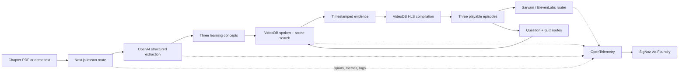

# KathaQuest

> Turn textbook chapters into multilingual video adventures using real educational footage.

KathaQuest reads a science chapter, extracts three age-appropriate concepts, searches a trusted archive for exact moments that explain them, and compiles those moments into playable micro-lessons. Children can listen in English or Hindi, ask a typed or spoken question, and get an answer backed by another real video clip.

The demo archive contains six public-domain U.S. Geological Survey videos. VideoDB—not a mock—provides ingestion, spoken-word indexing, scene understanding, semantic retrieval, timestamp evidence and HLS compilation.


## Why it exists

Textbooks can feel static, while the best explanation may be buried inside a long lecture or scientific recording. Generic AI video generation introduces another problem: the picture can look convincing without being real.

KathaQuest uses the chapter as a learning roadmap and retrieves evidence from trusted footage. Every clip exposes its source, licence, timestamps and relevance score.

## Demo flow

1. Select the preloaded volcano chapter or upload a text-based PDF.
2. Choose an age group and English or Hindi.
3. Generate exactly three concepts and three real VideoDB episodes.
4. Listen to a child-friendly explanation.
5. Ask a typed question or record a short Hindi question.
6. Complete the quiz; missed concepts create a VideoDB revision reel.
7. Arm the developer failure control, request English narration, and watch the system recover from ElevenLabs to Sarvam.
8. Inspect the matching trace, metrics and structured logs in SigNoz.

## Architecture



The app is one strict-TypeScript Next.js repository. External credentials remain in server-only environment variables; browser responses never include them.

## VideoDB depth

- Six real public-domain USGS sources uploaded into one supplied collection
- Spoken-word indexes for narrated educational evidence
- Scene indexes describing vents, craters, lava, ash, gas and eruption processes
- Collection-wide semantic search across both index types
- Deduplication of overlapping timestamp results
- One automatic LLM query rewrite when a search is empty
- Exact source title, start/end time, match type and confidence in the UI
- Search-result compilation into browser-playable HLS
- New searches for child questions and quiz revision

Source and licence records live in [`data/demo-videos.json`](data/demo-videos.json). Runtime VideoDB IDs are cached locally by the seeding script and intentionally ignored by Git.

## SigNoz observability

The root `lesson.generate` trace includes:

- `document.extract`
- `llm.extract_concepts`
- `videodb.search_concept`
- `videodb.rewrite_query`
- `videodb.compile_episode`
- `sarvam.speech_to_text`
- `llm.answer_question`
- `tts.generate`
- `tts.fallback`
- `quiz.evaluate`
- `revision.compile`
- `lesson.persist`

Custom counters and histograms cover lesson success/failure/duration, VideoDB latency/results/empty searches, TTS latency/failures/fallbacks, questions and revision reels. Pino logs include trace ID, span ID, lesson ID, event and provider fields.

The controlled failure is intentionally visible: `tts.generate` fails for ElevenLabs, `kathaquest.tts.failures` increases, `tts.fallback` records recovery, Sarvam returns real audio, and the UI reports both failure and recovery.

## Stack

- Next.js 16, React 19, TypeScript 5 (strict)
- OpenAI Responses API structured outputs + Zod
- VideoDB Node.js SDK and HLS.js
- Sarvam AI Bulbul v3 TTS and Saarika STT
- ElevenLabs multilingual TTS when credentials are present
- OpenTelemetry traces/metrics and Pino structured logs
- SigNoz installed reproducibly with Foundry
- Tailwind CSS 4 plus purpose-built accessible components

## Local setup

Requirements: Node.js 22+, npm, Docker Desktop, and credentials for VideoDB, OpenAI and Sarvam. ElevenLabs is optional for local Hindi-first development but required to demonstrate a successful English primary-provider request.

```bash
git clone https://github.com/PraveerSharma/kathaquest.git
cd kathaquest
npm install
cp .env.example .env.local
```

Fill `.env.local`; never commit it.

```bash
npm run verify-services
npm run seed
npm run dev
```

Open [http://localhost:3000](http://localhost:3000).

The seed script is resumable. It reuses cached VideoDB IDs and does not upload a source twice. Set `SEED_LIMIT=1 npm run seed` to prove one vertical slice first.

## Environment variables

| Variable | Purpose |
| --- | --- |
| `VIDEODB_API_KEY` | Server-side VideoDB access |
| `VIDEODB_COLLECTION_ID` | Trusted archive collection |
| `OPENAI_API_KEY` | Structured chapter reasoning |
| `OPENAI_MODEL` | Defaults to `gpt-5.6` |
| `SARVAM_API_KEY` | Hindi/English TTS and Hindi STT |
| `ELEVENLABS_API_KEY` | English primary TTS |
| `ELEVENLABS_VOICE_ID` | English narration voice |
| `OTEL_*` | Service name and OTLP HTTP endpoints |
| `SIGNOZ_URL` | Local SigNoz UI |
| `SIGNOZ_MCP_URL` | Local SigNoz MCP endpoint |
| `DEMO_MODE` | Enables the controlled failure route |

## SigNoz with Foundry

```bash
curl -fsSL https://signoz.io/foundry.sh | bash
foundryctl gauge -f casting.yaml
foundryctl cast -f casting.yaml
curl -fsS localhost:8000/livez
```

Expected endpoints:

- SigNoz UI: `http://localhost:8080`
- OTLP HTTP: `http://localhost:4318`
- OTLP gRPC: `http://localhost:4317`
- SigNoz MCP: `http://localhost:8000/mcp`

Both [`casting.yaml`](casting.yaml) and [`casting.yaml.lock`](casting.yaml.lock) are committed for reproducibility. Dashboard panels, alerts and validation steps are in [`signoz/DASHBOARDS_AND_ALERTS.md`](signoz/DASHBOARDS_AND_ALERTS.md).

## Verification

```bash
npm run lint
npm run typecheck
npm run build
# With npm run dev active:
npm run smoke-test
```

The smoke test performs a real lesson generation and fails if it does not receive exactly three concepts, three episodes, playable stream URLs and evidence.

## Public media and licences

All demo media is from the U.S. Geological Survey Multimedia Gallery and marked Public Domain on its source page. KathaQuest displays the source page and licence beside every retrieved clip. See [`data/demo-videos.json`](data/demo-videos.json) for the six exact media URLs, descriptions and source pages.

## Failure recovery demo

1. Generate a lesson.
2. In the developer observability panel, choose **Simulate ElevenLabs failure**.
3. On an English lesson, choose **Listen to explanation**.
4. Confirm the UI says “Primary voice provider failed” and “Recovered using Sarvam AI.”
5. In SigNoz, open the lesson trace and inspect `tts.generate` followed by `tts.fallback`.

## Known limitations

- Lesson storage is in-memory on serverless deployments and local JSON in development.
- The revision reel currently targets the first missed concept.
- Visual and transcript indexing is prepared for the volcano archive only.
- Self-hosted SigNoz must run locally; a hosted deployment needs a reachable OTLP endpoint.
- ElevenLabs credentials are not included and must be supplied separately.

## Post-hackathon roadmap

Teacher-curated archives and approval, more subjects, curriculum mapping, regional-language expansion, accessibility modes, learning outcome tracking, publisher integrations and adaptive student revision.

## AI Tools Disclosure

We used OpenAI Codex as a coding assistant for implementation, debugging and documentation. All product decisions, integration choices, testing and final submission review were performed by the team.

## Team

Built by Praveer Sharma for the VideoDB “Unlock the Footage” and Agents of SigNoz hackathons.
