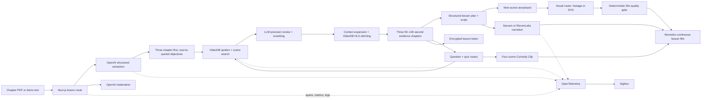

# KathaQuest

> Turn any chapter into one multilingual, interactive lesson film.

KathaQuest is an AI lesson studio. It reads a science chapter, creates a
source-grounded lesson plan, writes an educational script, builds a nine-scene
storyboard, and renders one continuous Remotion film from real footage,
animated diagrams, highlighted keywords, subtitles and Maya the Explorer.
Children can change the complete lesson and audio among 11 Indian languages,
ask a typed or spoken question, and receive a grounded 40–70 second Curiosity
Clip that combines a direct answer, Remotion diagrams, narration and reviewed
footage only when the archive contains direct evidence.

The reviewed archive contains 12 all-ages videos from USGS, NASA, NOAA and the U.S. National Park Service. VideoDB—not a mock—provides ingestion, spoken-word indexing, scene understanding, semantic retrieval, timestamp evidence, HLS compilation and narration/video composition.

The bundled chapter pack is backed by prevalidated results created with the
same real OpenAI and VideoDB pipeline, so the judge-facing demo opens in
seconds. General PDF uploads always run through the full live pipeline. A
locked, same-origin media route rewrites only allowlisted VideoDB HLS manifests
and segments, avoiding third-party CORS failures without becoming an open
proxy. If VideoDB cannot render an individual stitched segment, playback
automatically continues from the exact reviewed timestamp range in the original
public source.


## VideoDB hackathon submission

**One-line pitch, 114 characters:** KathaQuest turns any science chapter into a multilingual lesson grounded in timestamped, kid-safe VideoDB footage.

**Short description, under 200 words:** KathaQuest is an AI lesson studio for
children. A learner chooses a prepared science chapter or uploads a text-based
PDF. The app plans three learning objectives, writes a complete explanation,
and searches a collection of 12 real educational videos from NASA, NOAA, USGS,
and NPS. VideoDB provides media ingest, spoken-word and scene indexes,
collection search, timestamped retrieval, HLS compilation, and Editor Timeline
composition for translated narration. KathaQuest pools several focused
queries, keeps only reviewed all-ages sources, removes overlapping results, and
uses a structured relevance gate before any clip reaches the child. Retrieved
moments become evidence chapters, real-footage scenes in one Remotion lesson,
follow-up answers, and quiz revision reels. When the collection lacks a strong
match, KathaQuest uses a chapter-grounded diagram instead of unrelated footage.
The lesson remains useful without weakening trust.

- [Live product](https://kathaquest.vercel.app)
- [VideoDB build story](https://kathaquest.vercel.app/blog/kathaquest-videodb)
- [132-second captioned product demo](https://kathaquest.vercel.app/demo/kathaquest-videodb-hackathon-demo.mp4)

## Why it exists

Textbooks can feel static, while the best explanation may be buried inside a long lecture or scientific recording. Generic AI video generation introduces another problem: the picture can look convincing without being real.

KathaQuest uses the chapter as a learning roadmap and retrieves evidence from trusted footage. Every clip exposes its source, licence, timestamps and relevance score.

## Demo flow

1. Select one of five original chapter stories or upload a text-based PDF.
2. Choose an age group and one of 11 Indian languages.
3. Generate three concepts, three deep VideoDB evidence chapters, a structured
   lesson plan, complete script and executable storyboard. The planner keeps the
   chapter's most important concepts even when the footage archive has no match.
4. Open the Lesson Studio and play one 3–4 minute hybrid film containing Maya,
   diagrams, animations, real footage, captions, keywords and a checkpoint.
5. Change the learning language once to update the lesson, captions, quiz and
   film narration together.
6. Ask a typed or spoken question. Read the grounded answer immediately while
   Maya prepares a four-scene narrated Curiosity Clip in the background.
   Complete the quiz; missed concepts create a VideoDB revision reel.
7. Inspect the matching trace, metrics and structured logs in SigNoz.

## Architecture



The executable presentation design and layer-by-layer implementation are in
[`HYBRID_LESSON_ARCHITECTURE.md`](HYBRID_LESSON_ARCHITECTURE.md).

### Film quality workflow

KathaQuest treats generated JSON as a draft, not the finished lesson. A
deterministic post-planning pass checks every film before playback:

- Chapter-first planning preserves the foundation, mechanism and consequence
  that a child needs to understand, whether or not matching footage exists.
- VideoDB clips must pass both an LLM evidence review and a combined semantic
  confidence threshold; weak clips become chapter-grounded visual explainers.
- Narration timing targets a calm 90–110 words per minute, adds sentence pauses
  and keeps scenes long enough for a child to read the captions.
- Repeated footage, transitions and camera motions are rotated so the film has
  a deliberate visual rhythm instead of a slideshow feel.
- Grounding, pacing, visual variety, engagement and readability produce a
  visible film-quality score. The same score is recorded in OpenTelemetry for
  diagnosis in SigNoz.

## VideoDB depth

- Twelve real, reviewed sources from USGS, NASA, NOAA and NPS in one collection
- Spoken-word indexes for narrated educational evidence
- Detailed visual scene indexes describing educational actions, objects, diagrams and processes
- Collection-wide semantic search across both index types and up to three objective-specific queries
- Kid-safe allowlist filtering before any clip can be compiled
- Cross-query pooling, topic boosting and deduplication of overlapping timestamp results
- A structured LLM precision gate that rejects indirect evidence and records its reason and confidence
- Context expansion around useful moments and stitching of up to four complementary clips
- A 50-second minimum for generated lesson episodes
- One automatic LLM query rewrite when a search is empty
- Exact source title, start/end time, match type and confidence in the UI
- Search-result compilation into browser-playable HLS
- Sarvam narration uploaded as a VideoDB audio asset and synchronized with the original clip timeline
- New searches for child questions and quiz revision

Source and licence records live in [`data/demo-videos.json`](data/demo-videos.json). Runtime VideoDB IDs are cached locally by the seeding script and intentionally ignored by Git. The evaluated VideoDB capabilities, implementation decisions and provider limitations are recorded in [`VIDEODB_RESEARCH.md`](VIDEODB_RESEARCH.md).

### VideoDB primitives used

| VideoDB primitive | KathaQuest use | Implementation |
| --- | --- | --- |
| `connect` and `getCollection` | Open the reviewed educational archive | [`scripts/seed-videodb.ts`](scripts/seed-videodb.ts), [`lib/videodb.ts`](lib/videodb.ts) |
| `collection.uploadURL` | Ingest real NASA, NOAA, USGS and NPS source videos | [`scripts/seed-videodb.ts`](scripts/seed-videodb.ts) |
| `video.indexSpokenWords` | Search what educators say in each recording | [`scripts/seed-videodb.ts`](scripts/seed-videodb.ts) |
| `video.indexScenes` | Search objects, actions, diagrams and visible processes | [`scripts/seed-videodb.ts`](scripts/seed-videodb.ts) |
| `collection.search` | Run objective-specific spoken-word and scene searches | [`lib/videodb.ts`](lib/videodb.ts) |
| `SearchResult.compile` | Stitch reviewed timestamp ranges into an HLS lesson reel | [`lib/videodb.ts`](lib/videodb.ts) |
| `collection.uploadFile` | Upload generated regional-language narration audio | [`lib/video-localization.ts`](lib/video-localization.ts) |
| `EditorTimeline`, `Track` and `Clip` | Synchronize localized narration with selected VideoDB ranges | [`lib/video-localization.ts`](lib/video-localization.ts) |
| `EditorTimeline.generateStream` | Produce the localized playable timeline | [`lib/video-localization.ts`](lib/video-localization.ts) |

## Language and voice support

English, Hindi, Bengali, Tamil, Telugu, Marathi, Gujarati, Kannada, Malayalam, Punjabi and Odia are supported. Changing the learning language localizes the title, objectives, explanations and quiz into the language’s native script while preserving the original verified chapter quote internally.

Sarvam Bulbul v3 and ElevenLabs multilingual TTS are both supported. Children
can change the language of a single evidence reel or the complete lesson film
without changing the written lesson. Auto mode prefers Sarvam for Indian
languages and uses the configured provider fallback when necessary. Voices use a warm, slightly slower
educational delivery rather than imitating a child.

## SigNoz observability

The root `lesson.generate` trace includes:

- `document.extract`
- `llm.extract_concepts`
- `llm.create_lesson_presentation`
- `videodb.search_concept`
- `videodb.rewrite_query`
- `videodb.compile_episode`
- `sarvam.speech_to_text`
- `llm.answer_question`
- `llm.create_curiosity_clip`
- `curiosity.answer`
- `curiosity.generate`
- `curiosity.generate_narration`
- `tts.generate`
- `tts.fallback`
- `presentation.generate_narration`
- `quiz.evaluate`
- `revision.compile`
- `lesson.persist`

Custom counters and histograms cover lesson success/failure/duration, VideoDB latency/results/empty searches, TTS latency/failures/fallbacks, questions, Curiosity Clip generation/narration and revision reels. Pino logs include trace ID, span ID, lesson ID, event and provider fields.

The controlled failure is intentionally visible: `tts.generate` fails, `kathaquest.tts.failures` increases, and the UI explains the error without losing the generated lesson.

## Stack

- Next.js 16, React 19, TypeScript 5 (strict)
- OpenAI Responses API structured outputs + Zod
- VideoDB Node.js SDK and HLS.js
- Sarvam AI Bulbul v3 multilingual TTS and Saarika STT
- OpenTelemetry traces/metrics and Pino structured logs
- Remotion Player for deterministic scene composition
- SigNoz installed reproducibly with Foundry/Docker
- Tailwind CSS 4 plus purpose-built accessible components

## Local setup

Requirements: Node.js 22+, npm, Docker Desktop, and credentials for VideoDB, OpenAI and Sarvam.

```bash
git clone https://github.com/PraveerSharma/kathaquest.git
cd kathaquest
npm install
cp .env.example .env.local
```

Fill `.env.local`; never commit it.

```bash
npm run verify-services
npm run seed
npm run dev
```

Open [http://localhost:3000](http://localhost:3000).

The seed script is resumable. It reuses cached VideoDB IDs and does not upload a source twice. Set `SEED_LIMIT=1 npm run seed` to prove one vertical slice first.

## Judge testing guide

### Fast production test

1. Open [kathaquest.vercel.app](https://kathaquest.vercel.app).
2. Under **Start with a ready PDF**, choose **How Bees Help Plants Grow**.
   Confirm that the upload area changes to a green PDF-ready state.
3. Choose the learner age and language, then select **Create my video
   adventure**. The URL should change to `/adventure/<lesson-id>`.
4. Wait for the lesson status to report that every episode audio track is
   ready. Video controls remain locked until narration is available, so an
   episode cannot start silently.
5. Play a reviewed VideoDB reel directly inside its episode card. Check the
   source, licence, timestamps and review score beside it.
6. Return Home and choose **How Sound Travels**. This deliberately exercises
   limited archive coverage. Its chapter-grounded narrated visual should play
   inside the same episode card without opening another page.
7. Change **Learning language** to Hindi or another Indian language. Wait for
   the completion message confirming that content and every episode voice are
   ready.
8. In **Still curious?**, ask a chapter question. Confirm that the grounded
   text appears first, followed by an inline four-scene narrated Curiosity
   Clip. Ask the same question again or revisit the page to verify the saved
   clip and prepared narration are reused.
9. Open **SigNoz live dashboard**, then return through **My adventure**.
   Prepared audio should be restored from the browser media cache instead of
   being generated again.
10. Open the **VideoDB story** to inspect the retrieval architecture and design
   decisions.

### Local deterministic checks

```bash
npm ci
npx playwright install
npm run lint
npm run typecheck
npm run build
npm run test:e2e
```

To run one fast browser target:

```bash
npx playwright test tests/e2e/kathaquest.spec.ts --project=chromium
```

### Live provider checks

After configuring `.env.local`, verify credentials and the complete paid
provider path:

```bash
npm run verify-services
npm run seed
npm run smoke-test
RUN_LIVE_E2E=1 npx playwright test tests/e2e/live-services.spec.ts --project=chromium
```

The live checks call OpenAI, VideoDB and the configured voice provider. They
may consume API quota and take several minutes because they generate and
localize real lessons.

## Environment variables

| Variable | Purpose |
| --- | --- |
| `VIDEODB_API_KEY` | Server-side VideoDB access |
| `VIDEODB_COLLECTION_ID` | Trusted archive collection |
| `OPENAI_API_KEY` | Structured chapter reasoning |
| `OPENAI_MODEL` | Defaults to `gpt-5.6` |
| `LESSON_SIGNING_SECRET` | 32+ character key for encrypted stateless lesson sessions |
| `SARVAM_API_KEY` | Eleven-language narration and speech-to-text |
| `ELEVENLABS_API_KEY` | Multilingual TTS provider and fallback |
| `ELEVENLABS_VOICE_ID` | Warm production narration voice |
| `OTEL_*` | Service name, OTLP HTTP endpoints and optional headers |
| `SIGNOZ_INGESTION_KEY` | SigNoz Cloud ingestion key when used |
| `NEXT_PUBLIC_SIGNOZ_URL` | Optional production dashboard link |
| `SIGNOZ_URL` | SigNoz Cloud workspace or local UI |
| `SIGNOZ_MCP_URL` | SigNoz Cloud or local MCP endpoint |
| `SIGNOZ_API_KEY` | Server-side SigNoz service-account key |
| `KATHAQUEST_ALERT_WEBHOOK_URL` | Authenticated production alert receiver |
| `SIGNOZ_WEBHOOK_USERNAME` | Alert webhook basic-auth username |
| `SIGNOZ_WEBHOOK_PASSWORD` | Alert webhook basic-auth password |
| `DEMO_MODE` | Enables the controlled failure route |

## SigNoz with Foundry

Production exports OTLP/HTTP traces to SigNoz Cloud and reads the in-app
observability summary through the authenticated SigNoz MCP server. The
Cloud workspace contains:

- `KathaQuest AI lesson pipeline`
- `KathaQuest AI provider reliability`
- alerts for lesson latency, VideoDB relevance, and pipeline errors

The Foundry setup below remains available as a reproducible local fallback; it
is not required to keep the production application or dashboard running.

```bash
curl -fsSL https://signoz.io/foundry.sh | bash
foundryctl gauge -f casting.yaml
foundryctl cast -f casting.yaml
docker compose \
  -f pours/deployment/compose.yaml \
  -f signoz/compose.telemetry.yaml \
  up -d --force-recreate ingester
curl -fsS localhost:8080/api/v1/health
```

Expected endpoints:

- SigNoz UI: `http://localhost:8080`
- OTLP HTTP: `http://localhost:4318`
- OTLP gRPC: `http://localhost:4317`
- SigNoz MCP: `http://localhost:8000/mcp`

Both [`casting.yaml`](casting.yaml) and [`casting.yaml.lock`](casting.yaml.lock)
are committed for reproducibility. The setup script creates two dashboards,
three alerts and an authenticated notification channel idempotently. Dashboard
panels, alert definitions and validation steps are in
[`signoz/DASHBOARDS_AND_ALERTS.md`](signoz/DASHBOARDS_AND_ALERTS.md).

The small Compose override keeps the local OTLP pipelines active before the first SigNoz owner finishes UI onboarding. Without it, the pre-onboarding OpAMP default can temporarily replace trace, metric, and log pipelines with no-op pipelines.

## Verification

```bash
npm run lint
npm run typecheck
npm run build
npm run test:e2e
# With npm run dev active:
npm run verify-curiosity
npm run smoke-test
npm run evals
```

The browser suite runs deterministic tests across Chromium, Firefox, WebKit
and Pixel 7, plus opt-in paid live-service tests. It covers real PDF
extraction, navigation, inline VideoDB and visual playback, the continuous
lesson studio, nine storyboard scenes, cached narration, every language option,
localization, four-scene Curiosity Clips, cached question narration, quiz,
reset, error recovery and microphone feedback.
Set `RUN_LIVE_E2E=1` to exercise the paid OpenAI, VideoDB and voice path in
Chromium.

The smoke test performs real lesson generation and verifies exactly three concepts and episodes, 50-second-or-longer playable streams, Bengali localization and synchronized narration, evidence, a grounded Curiosity Clip with two synchronized narration acts, quiz scoring, encrypted lesson tokens, and no readable answer leak. The evaluation suite runs all five bundled chapters against grounding, child safety, coverage, duration and evidence-review contracts. Use `EVAL_CHAPTERS=water-cycle,photosynthesis npm run evals` for a targeted run.

## Public media and licences

The catalog uses reviewed educational media from USGS, NASA, NOAA and NPS. Every entry records its authority, audience, safety note, topics, source page, and licence/usage designation. KathaQuest displays source details beside every retrieved clip. See [`data/demo-videos.json`](data/demo-videos.json).

## Production posture and limitations

- Lesson interactions are stateless and serverless-safe through encrypted,
  expiring tokens. The browser stores the current lesson for navigation;
  IndexedDB also retains prepared narration when the learner visits another
  page and comes back. Persistent multi-device history still needs a database
  and authentication.
- Rate limiting is best-effort per runtime instance. A distributed limiter should replace it before large public traffic.
- Uploaded PDFs are text-based and capped at 10 MB; OCR is not included.
- Retrieval is safe by construction but limited to the reviewed 12-video
  corpus, so not every chapter concept has matching footage.
- When a reviewed VideoDB match remains unavailable after query rewriting and
  lesson replanning, the concept becomes a source-grounded visual explainer.
  The UI states that no unrelated footage was substituted.
- Regional-language localization and composed narration are generated on demand and can take roughly 30–45 seconds each.
- VideoDB SDK `indexAudio` upgrades currently return an HTTP 500 for this collection; the production path uses the working spoken-word and visual-scene indexes and remains functional.
- VideoDB’s CDN segments do not send browser CORS headers consistently. The
  production player therefore uses a host-allowlisted same-origin proxy for
  manifests and segments, with exact-source timestamp fallback for upstream
  segment failures.
- The currently supplied ElevenLabs key is rejected with HTTP 401. Production
  remains usable because automatic routing falls back to the verified Sarvam
  voice service; replace the key to exercise ElevenLabs specifically.
- The revision reel currently targets the first missed concept.
- Self-hosted SigNoz is healthy in local Docker. Vercel telemetry uses
  `@vercel/otel` and is ready for a SigNoz Cloud endpoint or authenticated
  public collector; a localhost collector cannot receive production traffic.
- The current release plays a continuous Remotion film in the browser.
  Downloadable MP4 rendering should run asynchronously on Remotion Lambda or a
  dedicated worker.

## Bundled chapter pack

The PDFs in [`Chapter_Pack`](Chapter_Pack) cover volcanoes, the water cycle, the solar system, butterfly metamorphosis, and photosynthesis. Run `npm run build:chapters` after editing them to regenerate the UI catalog in [`data/chapter-pack.json`](data/chapter-pack.json).

## Post-hackathon roadmap

Teacher-curated archive expansion, OCR, curriculum mapping, persistent accounts, accessibility modes, learning-outcome tracking, publisher integrations, pre-generated popular language variants and adaptive student revision.

## AI Tools Disclosure

We used OpenAI Codex as a coding assistant for implementation, debugging and documentation. All product decisions, integration choices, testing and final submission review were performed by the team.

## Team

Built by Praveer Sharma for the VideoDB “Unlock the Footage” and Agents of SigNoz hackathons.
